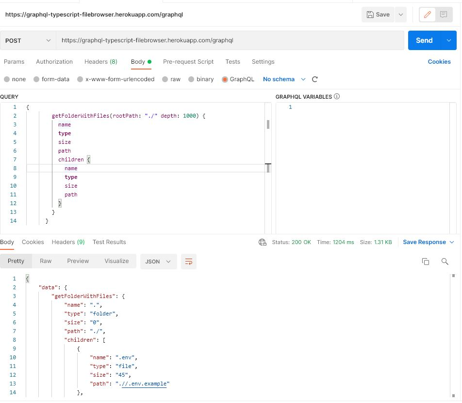

# Node Apollo Server with Graphql
## A simple local file browsing node express api built in Apollo server + Graphql + Typescript

This project is for demo purpose and live at <a href="https://graphql-typescript-filebrowser.herokuapp.com/graphql" target="_blank">Heroku</a>

You can test it via Postman Graphql or I also built a file manager window demo with React on my <a target="_blank" href="https://github.com/denizumutdereli/react-graphql-file-browsing">React  Graphql File Browsing<a/> repo. 

> npm install

> npm start
  
 
  ### There are two different queries and two parameters for each. 
  
  @Params: string = rootPath The root directory that you would like to see. (url will be fixed and max depth is configured to the project folder)
  @Params: number = depth The depth is configured at least 100.000, however you can change this.
  
  * getFolderWithFiles : Obtaining the full directory listing of a given directory path on the local filesystem. 
  * getNestedFolders : This query is for sidebar and building a preview tree. 
  
```graphql
{
		getFolderWithFiles(rootPath: "./" depth: 1000) {
		  name
		  type
		  size
		  path
		  children {
			name
			type
			size
			path
		  }
		}
	  }
```
  
```graphql
{
		{
		getNestedFolders(rootPath: "./", depth:5) {
			name
			path
			type
			children {
				name
				path
				type
				children {
					name
					path
					type
					children {
						name
						path
						type
						children {
							name
							path
							type
							children {
								name
								path
								type
								children {
									name
									path
									type
									children {
										name
										path
										type
										children {
											name
											path
											type
											children {
												name
												path
												type
												children {
													name
													path
													type
												}
											}
										}
									}
								}
							}
						}
					}
				}
			}
		}
	}
```
	
### Screenshots
  
  
